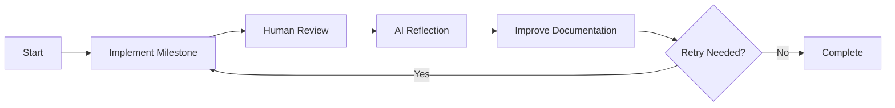

# 3D Sorting Algorithm Visualizer

An interactive 3D visualization of sorting algorithms built with Three.js. It demonstrates how different algorithms sort an array, with smooth animations, rainbow colors, and user controls.

---

## Implementation Process

This project was developed collaboratively with the AI model [Quasar Alpha](https://openrouter.ai/openrouter/quasar-alpha) (which was an early test version of [OpenAI GPT-4.1](https://openrouter.ai/openai/gpt-4.1)). The development was structured into milestones, each implemented step-by-step by the AI. After completing each milestone, the human operator, [Marc Ketel](https://github.com/atoomnetmarc/), reviewed the implementation and discussed the AI's experiences and challenges. These insights were then incorporated back into the milestone, creating an iterative feedback loop that refined the development process.



---

## Features

- Visualizes **over 25 sorting algorithms**, including Bubble Sort, Insertion Sort, Quicksort, Merge Sort, TimSort, Bitonic Sort, and more
- All algorithms implemented as **async generators** yielding visualization steps
- Each algorithm exports **metadata** (`name`, `description`, `isSlow`, etc.) used for UI and testing
- Adjustable speed slider
- Responsive, optimized layout with fixed rainbow gradient colors
- Dark theme
- Sorting indicators and highlighting
- Start/Pause and Step controls
- **Change algorithm during sorting** (mid-sort switching)
- Automatic cycling with countdown timer
- Camera controls (rotate, zoom, pan)
- **Finite State Machine (FSM)** manages sorting states (planned or implemented)

---

## Quick Start

Because ES module imports require a server context, **do not** open `index.html` directly. Instead, serve the project with a local web server.

### Using Node.js

```bash
npx serve
```

Open [http://localhost:3000](http://localhost:3000) in your browser.

### Using Python

```bash
python3 -m http.server
```

Open [http://localhost:8000](http://localhost:8000).

---

## Documentation

- [Setup Instructions](docs/Setup.md)
- [Implementation Guide](docs/Implementation.md)
- [Architecture Overview](docs/Architecture.md)
- [Sorting Algorithms](docs/Algorithms.md)
- [Troubleshooting & FAQ](docs/Troubleshooting.md)
- [Contributing Guidelines](docs/Contributing.md)

---

## Testing

This project uses [Jest](https://jestjs.io/) for unit testing of sorting algorithms.

### Install dependencies

If you haven't already, install all dependencies (including Jest):

```bash
npm install
```

### Run tests

To execute all unit tests:

```bash
npx jest
```

Or, if you have configured an npm script named `test`:

```bash
npm test
```

### Generate coverage report

To generate a code coverage report:

```bash
npx jest --coverage
```

The coverage report will be saved in the `coverage/` directory.

---

## License

This project is open source and free to use, see [LICENSE](LICENSE).
