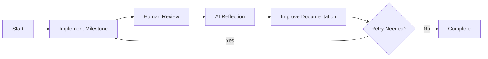

# 3D Sorting Algorithm Visualizer

An interactive 3D visualization of sorting algorithms built with Three.js. It demonstrates how different algorithms sort an array, with smooth animations, rainbow colors, and user controls.

## Implementation Process

This project was developed collaboratively with the AI model [Quasar Alpha](https://openrouter.ai/openrouter/quasar-alpha). The development was structured into milestones, each implemented step-by-step by the AI. After completing each milestone, the human operator, [Marc Ketel](https://github.com/atoomnetmarc/), reviewed the implementation and discussed the AI's experiences and challenges. These insights were then incorporated back into the milestone, creating an iterative feedback loop that refined the development process. Throughout development, approximately 15 full retries were necessary. Each retry involved discarding the entire implementation while preserving the documentation, then starting anew with improved insights. This iterative approach led to progressively better implementations with each cycle.



## Features

- Visualizes multiple algorithms: Bubble Sort, Insertion Sort, Quicksort, and more
- Adjustable speed slider
- Responsive, optimized layout
- Fixed rainbow gradient colors
- Dark theme
- Sorting indicators
- Start/Pause and Step controls
- Change algorithm during sorting
- Automatic cycling with countdown timer
- Camera controls (rotate, zoom, pan)

## Quick Start

Because ES module imports require a server context, **do not** open `index.html` directly. Instead, serve the project with a local web server.

### Using Node.js

```bash
npx serve
```

Open [http://localhost:3000](http://localhost:3000) in your browser.

### Using Python

```bash
python3 -m http.server
```

Open [http://localhost:8000](http://localhost:8000).

## Documentation

- [Setup Instructions](docs/Setup.md)
- [Implementation Guide](docs/Implementation.md)
- [Architecture Overview](docs/Architecture.md)
- [Sorting Algorithms](docs/Algorithms.md)
- [Troubleshooting & FAQ](docs/Troubleshooting.md)
- [Contributing Guidelines](docs/Contributing.md)

## License

This project is open source and free to use, see [LICENSE](LICENSE).
