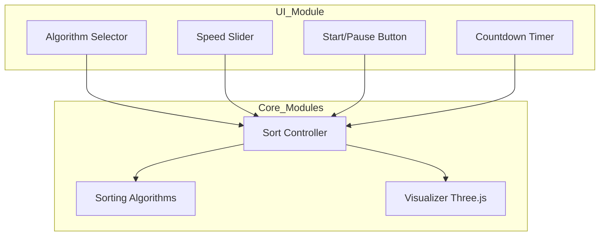

# Architecture Overview

The 3D Sorting Algorithm Visualizer is designed with a modular architecture that separates concerns into dedicated components, ensuring maintainability, extensibility, and clarity.

---

## Modules

### `ui.js`

Handles all user interface elements:

- Algorithm selector dropdown
- Speed slider
- Start/Pause and Step buttons
- Countdown timer display
- User interaction event listeners

### `visualizer.js`

Manages the 3D visualization using Three.js:

- Initializes scene, camera, lights, and controls
- Creates sorting bars
- Handles window resizing
- Highlights compared elements with indicator dots

### `sortController.js`

Controls the sorting process:

- Manages sorting state, pause/resume, and step functionality
- Interfaces with sorting algorithm generators
- Handles countdown timer and automatic algorithm switching
- Coordinates updates to the visualizer and UI

### `app.js`

Entry point:

- Imports all modules and sorting algorithms
- Initializes UI, visualizer, and sort controller
- Connects components on page load

### `algorithm/` directory

Contains individual sorting algorithms implemented as asynchronous generators yielding steps for visualization.

---

## Data Flow

1. User interacts with UI controls.
2. UI module notifies Sort Controller of user actions.
3. Sort Controller manages the sorting generator, controlling pause/resume/step.
4. Sorting algorithms yield steps, which Sort Controller uses to update highlights and data.
5. Visualizer highlights bars based on current data and indices.
6. Countdown timer triggers automatic algorithm switching and array resets.

---

## Design Principles

- **Separation of concerns:** Each module has a single, well-defined responsibility.
- **Modularity:** Components can be developed, tested, and extended independently.
- **Extensibility:** New features or algorithms can be added with minimal impact.
- **Maintainability:** Clear structure reduces complexity and bugs.

---

## Bar Object Structure

Each bar is a 3D object with:

- **height:** Corresponds to data value
- **position:** X and Y coordinates
- **color:** Fixed rainbow gradient based on value

This enables smooth animations and clear visual feedback.

---

## System Diagram

